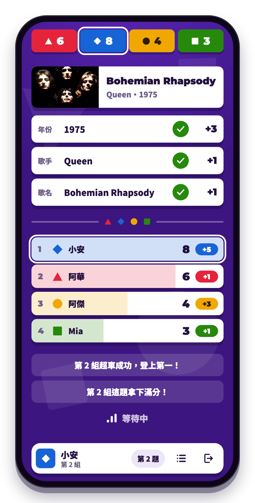
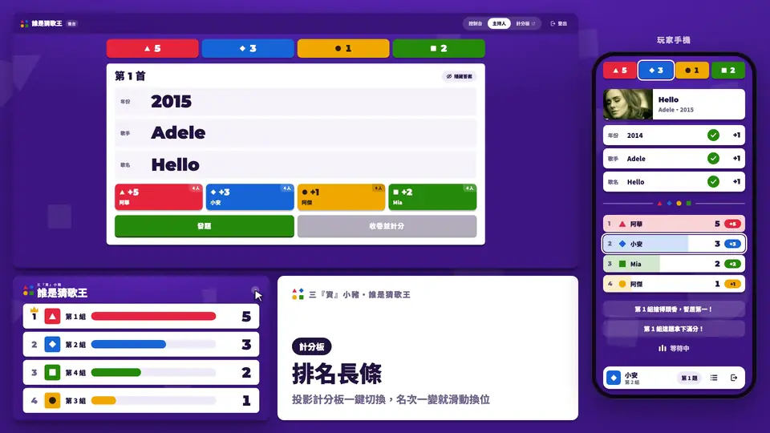

<div align="center">
<a href="https://song.ntust.org">
  
</a>
<br>

[](LICENSE)
[](https://workers.cloudflare.com)
[](https://developer.mozilla.org/docs/Web/JavaScript)

[繁體中文](README.md) | **English**

</div>

## Overview

<a href="https://song.ntust.org/">



</a>

Guess the Song (三『資』小豬・誰是猜歌王) is a scoring and phone-answering system for a song-guessing game

The host plays a song and players answer the year, artist and title on their phones. When the round closes, the answers are graded and the points are added automatically. The projected scoreboard updates at the same time.

The app itself is in Traditional Chinese.

### **Pages**
- **Player phone** (`/`) — join with a name and a group code, answer, then see what was right, the points and the group standings
- **Projector scoreboard** (`/scoreboard`) — every group's total full screen, as fixed tiles or ranked bars
- **Dashboard** (`/dashboard`) — pick songs, open and close rounds, follow the answers, change grades, adjust scores
- **Host** (`/host`) — the answer key in large type, plus each group's points and top scorer for the round

### **Highlights**
- **Live everywhere** — every page gets updates over WebSocket, no refreshing
- **Automatic grading** — the exact year +3, within 3 years +1; artist and title +1 each, homophones and small typos included; each group keeps its best answer per field
- **Game-show animations** — a countdown when a round opens; when it closes, a reveal, rank changes and auto-written commentary
- **Four or five groups** — switched by one setting; the fifth group is a cyan star
- **Fits the free plan** — an event with about 40 players and 70 songs is estimated to use only about a third of the Workers Free daily request limit

<br clear="right"/>

## Demo

<a href=".github/assets/demo.mp4">
  
</a>

Two rounds with mock data:
- When a round opens, every phone counts down at once and the answers show up in the dashboard as they arrive.
- When it closes, the scoreboard counts up and the ranks swap.

Click the image for the [full video](.github/assets/demo.mp4) (1:43).

<br/>

## Quick start

### Requirements

- Node 22 or newer (for wrangler and the tests)
- A Cloudflare account (to deploy)

### Running locally

```bash
git clone https://github.com/NTUST-OpenSource/guess-song.git
cd guess-song

npm ci                           # installs wrangler and pinyin-pro
cp .dev.vars.example .dev.vars   # fill in the admin login and AUTH_SECRET
npm test                         # tests
npm run dev                      # local server
```

Open <http://localhost:8787>. The admin pages start at `/login`.

> [!NOTE]
> There is no build step: the static files in `public/` are served as they are, and npm only installs wrangler and pinyin-pro, which wrangler bundles into the Worker to match homophones.

### Environment variables

| Name | Purpose |
|---|---|
| `USERNAME` | Admin username, shared by the dashboard and the host page |
| `PASSWORD` | Admin password |
| `AUTH_SECRET` | Random string that signs tokens (`openssl rand -base64 32`). Changing it signs everyone out at once, players included |
| `FIVE_GROUPS` | Optional. `1`, `true` or `True` adds a fifth group, and every page and the site icon switch to five groups. Any other value, or leaving it unset, keeps four |

Locally they go in `.dev.vars`. In production, set all four as secrets:

```bash
npx wrangler secret put USERNAME
npx wrangler secret put PASSWORD
npx wrangler secret put AUTH_SECRET
npx wrangler secret put FIVE_GROUPS   # only for five groups
```

> [!IMPORTANT]
> `FIVE_GROUPS` is not secret, but set it as a secret anyway. Plain variables set in the Cloudflare dashboard are removed by the next deploy.

### Deployment

Merging to `main` deploys to <https://song.ntust.org> through Workers Builds. The domain and the account are configured in `wrangler.jsonc`. To deploy by hand, run `npm run deploy`.

<br/>

## Running a game

1. Before the game, open the dashboard settings (the gear), set each group's code and upload the song list
2. Pick a song (or press 下一首, "next song"); the host page shows its answer key
3. Press 發題 ("open") and every phone counts down and starts answering; press 收卷並計分 ("close and score") to grade and add the points
4. After a round closes, click a grade under 作答狀況 ("answers") to change it; the totals adjust by the difference

### Song list

The song list contains the answers, so keep it out of git. Write `songs.json` in the format of `songs.example.json` (`songs*.json` is gitignored), then upload it under 歌單與解答 ("songs and answers") in the dashboard settings.

```json
[
    {
        "year": 2000,
        "artist": ["範例歌手", "Example Artist"],
        "title": "範例歌名",
        "youtube": "https://www.youtube.com/watch?v=xxxxxxxxxxx"
    },
    { "year": 2010, "artist": "另一位歌手", "title": ["另一首歌", "別名"] }
]
```

- `artist` and `title` take a string or an array; every spelling in the array counts as correct
- `youtube` is optional and must be an http or https URL
  - With it, the dashboard links to the video and phones show its thumbnail after the round
  - Without it, the link searches YouTube for the song
- Songs are numbered by position. A song that has been played can only be corrected in place; add new songs at the end
- The answers stay on the server; players only get a song's answer after its round closes

### Scoring

- The exact year +3, within 3 years +1; the right artist +1 and the right title +1. Case, full-width characters, spaces, punctuation and accents are ignored
  - Chinese homophones count, including simplified characters and 妳 for 你; zh/z, ch/c, sh/s and -ng/-n sound the same. A character more, less or different never counts, so add common short forms to the song list yourself
  - Letters and digits allow typos, not counting spaces and punctuation: up to 4 characters must match exactly, 5 to 8 may have one wrong, 9 or more may have two, and swapping two neighbors counts as one; digits must be exact
  - Answers are only compared with that song's answers; the rules live in `src/match.js`
- Each group keeps its best points per field, so a group can earn up to 5 per song
- Changing a grade or correcting the song list after a round adjusts the totals by the difference
- The commentary's conditions and wording live in `src/notes.js`

<br/>

## Tech stack

| Item | Choice |
|---|---|
| Backend | Cloudflare Workers; scores, songs and answers live in one Durable Object (`Scores`) |
| Live updates | WebSocket (Durable Object hibernation), one connection per page, no polling |
| Frontend | Plain HTML, CSS and JavaScript, no framework and no build |
| Static files | Workers Static Assets |
| Deployment | Workers Builds, deploying `main` |
| Tests | `npm test` (Node's built-in test runner and assert) |
| CI | GitHub Actions runs the tests and a trial bundle of the Worker; Dependabot updates wrangler and the Actions weekly |

### Project layout

```
src/index.js              Worker and Durable Object: API, WebSocket, grading and scoring
src/match.js              matching artists and titles: normalizing, homophones and typos
src/notes.js              commentary after each round
public/index.html         player phone
public/scoreboard.html    projector scoreboard
public/dashboard.html     dashboard and host (two views of one page; /host redirects here)
public/login.html         admin login
public/css/               base (shared), play, admin, scoreboard
public/js/                page scripts; live.js runs the WebSocket, scores.js updates the scores
public/five/              site icons for five groups
test/                     API and scoring tests
.github/                  CI, Dependabot and README images
package.json              wrangler version and npm scripts
wrangler.jsonc            Worker, domain, Durable Object and static file settings
```

<br/>

## API

<details>
<summary>Endpoints</summary>

POST bodies are JSON, except the login form

| Endpoint | Parameters | Description |
|---|---|---|
| `GET /api/GetScore` | — | Returns `{"1":0,...,"4":0}`, plus `"5"` with five groups |
| `GET /api/groups.js` | — | One line of JS that sets the group count on `<html data-groups>`; every page loads it first in `<head>` |
| `POST /api/login` | `username`, `password` | Returns `{status, msg, token}`; the token expires after 12 hours |
| `POST /api/AddScore` | `token`, `group`, `delta` | Adds `delta` points (may be negative; the result stays within 0–999) |
| `POST /api/SetScore` | `token`, `group`, `score` | Sets a score |
| `POST /api/join` | `name`, `code` | Joins with a group code (case-insensitive); returns `group` and a player token |
| `GET /api/ws` | `token` (query, optional) | WebSocket. With a player token, pushes that player's state; without one, only the totals. If the token is no longer valid, the first message carries `rejoin: true` |
| `POST /api/play/state` | `token` | The same state the WebSocket pushes, plus `result` after a round closes |
| `POST /api/play/history` | `token` | Closed rounds, most recent first |
| `POST /api/play/answer` | `token`, `year`, `artist`, `title` | Can be sent again while the round is open; the last one counts |
| `POST /api/admin/<action>` | `token`, ... | Admin actions: `state`, `songs`, `select`, `open`, `close`, `judge`, `passwords`, `reset`; see `handleAdmin` in `src/index.js` for parameters |

- `group` is an integer from 1 to 4, or 1 to 5 with five groups; `score` is an integer from 0 to 999
- Failed authentication returns 401 and bad parameters return 400
- Signing out only clears the token in the browser. Tokens are stateless signatures, so change `AUTH_SECRET` to revoke them all

</details>

<br/>

## Contributing

Bug reports via [Issues](https://github.com/NTUST-OpenSource/guess-song/issues) and Pull Requests are welcome

Before submitting a PR

1. UI copy and docs are Traditional Chinese; code comments are English
2. Commits follow [Conventional Commits](https://www.conventionalcommits.org/)
3. Name branches `feat/your-feature` or `fix/your-fix`
4. `npm test` passes
5. No Emoji

<br/>

## License

Copyright (C) 2026 xinshoutw

Licensed under the **GNU Affero General Public License v3.0**. See [LICENSE](LICENSE) for the full text

<br/>

## Disclaimer

This project is not officially affiliated with National Taiwan University of Science and Technology
